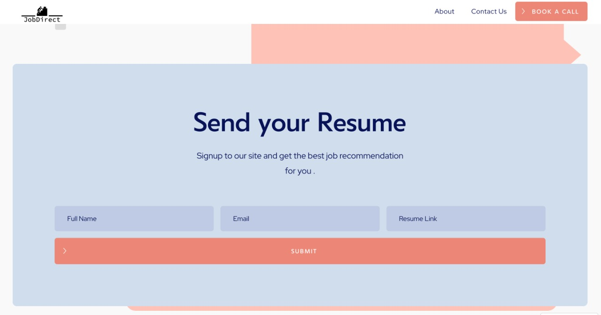
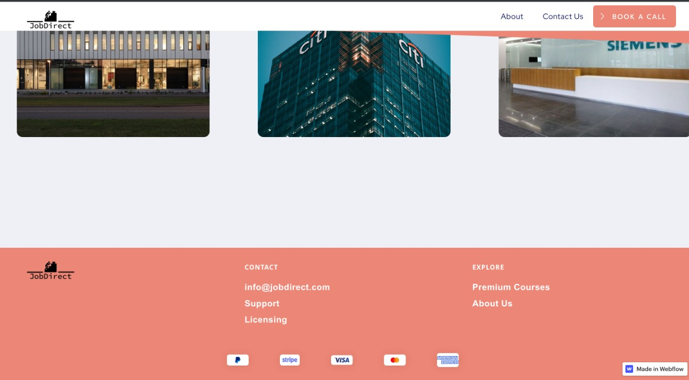
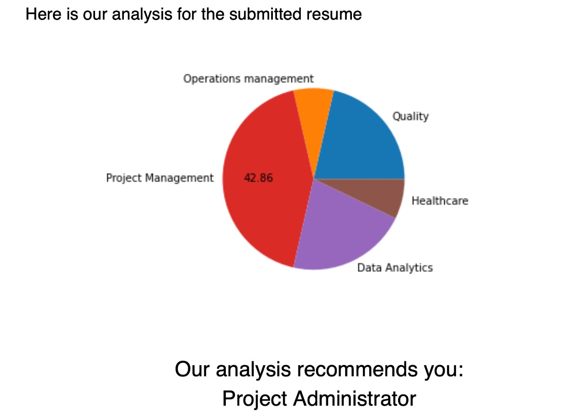

# JobDirect
Problem Statement
###
Build a system that recommends jobs based on resume 
###
Approach
###
JobDirect is the worldwide leader on insights about jobs and companies.
Built on the foundation of increasing workplace transparency, JobDirect offers insights into the employee experience powered by millions of company ratings and reviews, CEO approval ratings, salary reports, interview reviews and questions, benefits reviews, office photos and more, combined with the latest jobs.
Job seekers on JobDirect are well-researched and more informed about the jobs and companies they consider joining.
###
[JobDirect](https://dhruvils-stellar-site.webflow.io/)
###
## JobDirect Website

 &ensp;&ensp;&ensp;&ensp;&ensp;&ensp;&ensp;&ensp;&ensp;
 &ensp;&ensp;&ensp;&ensp;&ensp;&ensp;&ensp;&ensp;&ensp; 
 &ensp;&ensp;&ensp;&ensp;&ensp;&ensp;&ensp;&ensp;&ensp;
 &ensp;&ensp;&ensp;&ensp;&ensp;&ensp;&ensp;&ensp;&ensp;
 *Web*
- Figma
- Webflow

*Language*
- Python
- Tika,matplot,regex,fpdf
